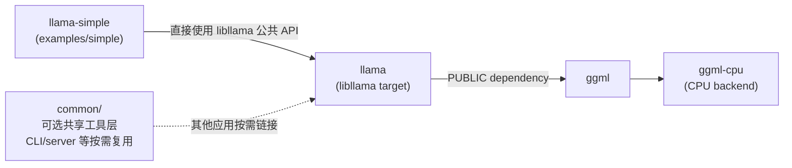

# week1 day5

## 习题1
目录导览**: 阅读 [`CMakeLists.txt`](../../CMakeLists.txt)、[`src/CMakeLists.txt`](../../src/CMakeLists.txt)、[`common/CMakeLists.txt`](../../common/CMakeLists.txt)、[`app/CMakeLists.txt`](../../app/CMakeLists.txt)。将应用层、`llama-common`、`libllama`、GGML、backend 的职责写成 5 行说明。

答：
第 143 行的学习目标，是通过 CMake 的真实 target 和链接关系建立 llama.cpp 的架构地图，而不是只凭目录名记忆模块。可写成以下 5 行：

1. **应用层**：`app/`、`examples/`、`tools/` 等可执行程序，负责参数解析、交互和具体工作流，通过公共 API 调用下层库。
2. **`llama-common`**：可选的共享工具层，提供命令行参数、聊天模板、采样辅助、JSON/语法、HTTP、缓存、日志等通用功能，并依赖 `llama`。
3. **`libllama`（CMake target：`llama`）**：模型加载、词表/tokenize、上下文、KV cache、计算图、采样和推理流程，向上提供 `include/llama.h` 公共 API，向下链接 `ggml`。
4. **GGML**：通用张量和计算图引擎，提供张量操作、量化、内存管理、图调度以及 backend 注册/管理机制。
5. **backend**：具体硬件执行实现，例如 `ggml-cpu`、CUDA、Metal、Vulkan 等，负责设备、内存和算子 kernel 的实际执行。

这项学习主要起四个作用：

- **确认真实依赖关系**：例如 `llama-simple -> llama -> ggml -> CPU backend`，避免把目录结构误认为编译依赖。
- **理解职责边界**：知道某个问题应该查应用、`llama-common`、`llama`、GGML 还是具体 backend。
- **提高构建和调试能力**：能够正确选择 CMake target、分析链接错误、切换 CPU/GPU backend，并理解哪些库是可选的。
- **为后续源码阅读建立入口**：从应用调用的公共 API，一路追到 `llama`、GGML 和硬件 backend，形成完整调用链。

因此，Day 5 不是单纯学习 CMake 语法，而是在学习“项目是如何分层、编译和连接起来的”。理解这一点后，后续复写程序、设置断点、定位性能问题都会更有方向。

## 习题2
画图**: 画 `llama-simple -> llama -> ggml -> CPU backend` 的 target 依赖图, 旁边标注 `common/` 为可选共享工具层, `examples/simple` 直接使用 `libllama` 公共 API。

答：
文档未改动。依赖图如下：



实线表示主 target 依赖链；`common/` 是可选共享工具层，不是 `llama-simple` 的必经依赖。

## 习题3
生命周期**: 完成 `model -> context -> batch -> sampler` 表, 分别写“创建者、使用者、释放函数、可否被多个 context 共享”。
答：
文档已恢复为未修改状态。生命周期表如下：

| 对象 | 创建者 | 使用者 | 释放函数 | 可否被多个 context 共享 |
|---|---|---|---|---|
| `llama_model` | 调用方通过 `llama_model_load_from_file()` 加载 | `llama_init_from_model()` 创建的 context，以及模型/词表查询 API | `llama_model_free()`，需在所有 context 释放后调用 | 可以。权重和词表可共享，但每个 context 有独立的 KV cache 和运行时状态 |
| `llama_context` | 调用方通过 `llama_init_from_model(model, params)` 创建 | `llama_decode()`、`llama_encode()`、状态查询、`llama_sampler_sample()` | `llama_free()` | 不应共享。每个 context 代表独立会话和状态；多个会话应创建多个 context |
| `llama_batch` | `llama_batch_get_one()` 包装 token，或 `llama_batch_init()` 分配完整 batch | `llama_decode()`、`llama_encode()` | `llama_batch_free()` 仅用于 `llama_batch_init()`；`llama_batch_get_one()` 返回的包装对象不需要释放 | 可以复用，但应串行提交，并保证底层 token/position 数组始终有效 |
| `llama_sampler` | `llama_sampler_chain_init()` 和 `llama_sampler_init_*()` | `llama_sampler_sample()`、`llama_sampler_apply()`、`llama_sampler_accept()` | `llama_sampler_free()`；chain 会释放通过 `llama_sampler_chain_add()` 加入的子 sampler | 通常不直接共享。sampler 可能携带会话状态，应按 context 创建，或使用 `llama_sampler_clone()` |

典型释放顺序：

```text
batch -> sampler -> context -> model
```

如果 sampler 通过 `llama_context_params.samplers` 或 `llama_set_sampler()` 挂接到 context，应保持 sampler 存活到 context 释放之后。

## 习题4
能说明 CMake 的 target 依赖而不是只背目录。
答：
这句话的意思是：验收时不能只说“`examples/` 是示例、`src/` 是核心、`ggml/` 是张量库”，而要能根据 `target_link_libraries()` 说出 CMake target 之间的真实依赖关系。

这里不要求列出整个项目的每一个 target，而是至少说清楚本题涉及的主链，以及 `common/` 的位置：

| Target | 直接依赖 | 说明 |
|---|---|---|
| `llama-simple` | `llama`，以及线程库 | 在 `examples/simple/CMakeLists.txt` 中定义；直接调用 `libllama` 公共 API |
| `llama` | `ggml` | 在 `src/CMakeLists.txt` 中以 `PUBLIC` 方式链接 `ggml` |
| `ggml` | `ggml-base`；静态 backend 配置下还链接 `ggml-cpu` | `ggml-base` 提供基础 tensor/图能力，backend 提供实际硬件执行 |
| `ggml-cpu` | `ggml-base` | CPU backend 的具体算子和执行实现 |
| `llama-common` | `llama`、`llama-common-base` 等 | 可选共享工具层，CLI/server 等目标按需使用，不是 `llama-simple` 的必需依赖 |

因此，最小验收回答可以是：

```text
llama-simple PRIVATE 依赖 llama；
llama PUBLIC 依赖 ggml；
ggml PUBLIC 依赖 ggml-base，并在静态 backend 配置下依赖 ggml-cpu；
ggml-cpu PRIVATE 依赖 ggml-base；
examples/simple 直接使用 libllama 公共 API；
common/ 对应的 llama-common 是可选共享工具层，不属于 llama-simple 的主依赖链。
```

需要注意，`ggml-cpu` 是否表现为 `ggml` 的链接依赖，取决于 backend 配置：

- 静态 backend：`ggml` 通常链接 `ggml-cpu`。
- 动态 backend：`ggml` 可能只通过 `add_dependencies()` 确保 backend 插件构建，运行时再加载 CPU backend。

所以文档中的：

```text
llama-simple -> llama -> ggml -> CPU backend
```

是学习用的主依赖链；更严格地说，应同时说明 `ggml -> ggml-base`，以及 CPU backend 的静态/动态构建差异。

## 习题5
回答 `model` 与 `context` 分离如何支持多个会话
答：
`model` 与 `context` 分离后，可以做到“模型只加载一次，每个会话拥有独立运行状态”。

- `llama_model` 保存相对稳定的共享数据：模型结构、超参数、词表、权重、mmap 信息和设备放置。
- `llama_context` 表示一次独立的推理运行实例，保存该会话自己的 KV cache、已处理位置、memory、计算 buffer、logits 输出等状态。

因此可以这样创建多个会话：

```cpp
llama_model * model = llama_model_load_from_file(path, model_params);

llama_context * ctx_a = llama_init_from_model(model, ctx_params);
llama_context * ctx_b = llama_init_from_model(model, ctx_params);

llama_decode(ctx_a, batch_a);  // 会话 A 的状态写入 ctx_a
llama_decode(ctx_b, batch_b);  // 会话 B 的状态写入 ctx_b
```

两个 context 共享同一个 model 的权重，但各自维护 KV cache 和上下文历史。会话 A 的 prompt、生成位置和缓存不会污染会话 B，同时避免为每个会话重复加载一份模型权重，节省内存和加载时间。

释放时应先释放所有 context，最后释放共享的 model：

```text
ctx_a -> ctx_b -> model
```

补充：也可以在单个 context 中使用多个 sequence ID 来承载多个会话，但这需要更复杂的 batch、sequence 和 KV cache 管理；多个 context 的隔离边界更清晰。

## 习题6
能解释 `n_batch` 的限制不等于 `n_ctx` 的容量
答：
`n_batch` 和 `n_ctx` 限制的是两个不同维度：

- `n_batch`：一次调用 `llama_decode(ctx, batch)` 最多提交多少个 token，是“单次处理量”。
- `n_ctx`：context 能保存和参与计算的上下文容量，是“总上下文窗口”。

例如：

```text
n_ctx   = 4096
n_batch = 512
```

表示一次最多处理 512 个 token，但一个会话的上下文容量仍可达到 4096 个 token。1500 个 prompt token 可以分成：

```text
512 + 512 + 476
```

多次调用 `llama_decode()` 完成 prefill，后续生成通常每次提交 1 个 token。

反过来：

```text
n_ctx   = 512
n_batch = 4096
```

也不代表程序获得了 4096 的上下文窗口。一次调用即使提交很多 token，实际可保留和使用的上下文容量仍受 `n_ctx` 限制，可能需要分块、截断或触发 context shift。

在多 sequence 场景中，`n_batch` 还是一次 decode 调用中所有 sequence 提交 token 数的逻辑上限；`n_ubatch` 则是内部物理分块大小。可以记成：

```text
n_batch = 一次 API 调用最多处理多少 token
n_ctx   = context 总共能容纳多少上下文
n_ubatch = 内部一次实际送入 backend 的物理批大小
```