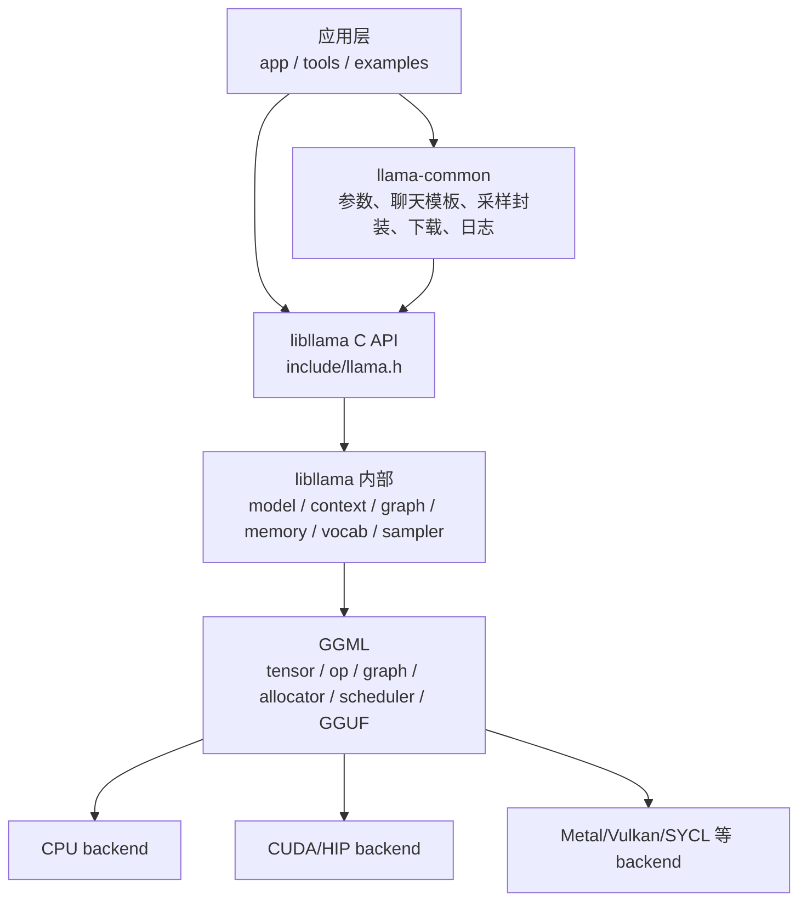
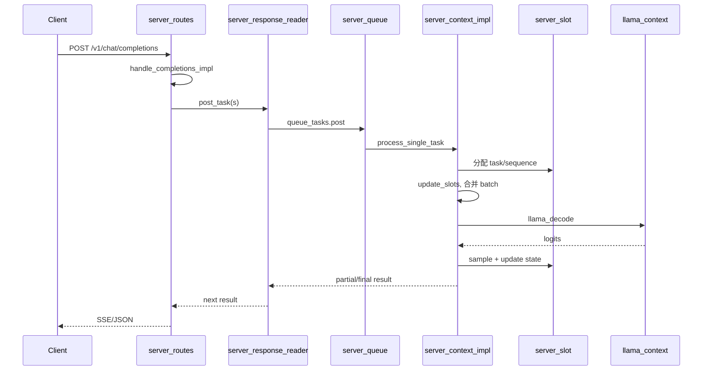

# llama.cpp 8 周深度学习与二次开发计划

> 适用仓库: `/home/king/llama.cpp`
>
> 基准版本: `master@3db4ff877`
>
> 学习者基础: 熟悉 C/C++、Linux 开发和 AI 编译器中的模型适配/调度工作, 但对 Transformer 的整体数据流、张量 shape 和自回归推理过程了解较少, 对 GGML、量化和 GPU 编程经验较少。详细背景见 [000. my base.md](<000. my base.md>)。
>
> 时间预算: 工作日每天 2 小时, 周末每天 4 小时, 每周约 18 小时, 8 周约 144 小时。

## 使用说明

这份计划不是按文件顺序浏览源码, 而是围绕 5 条真实调用链逐层深入。由于 Transformer 基础较少, 前 3 周采用“纸面模型 -> 小型数值例子 -> GGML graph -> llama.cpp 源码”的顺序, 不要求一开始推导完整论文或阅读全部 kernel。每周都必须留下可检查的输出物, 包括概念图、调用图、调试记录、实验数据或独立代码。只读不算完成。

学习时固定使用一个小型 decoder-only Transformer 作为参照模型。除非另有说明, 先用以下符号追踪 shape:

```text
B   = batch size
T   = sequence length
D   = hidden size
H   = attention head count
Dh  = head dimension, D / H
KvH = key/value head count, used by GQA
V   = vocabulary size
```

遇到源码中的 tensor, 先回答“它代表什么、shape 是什么、处于哪一步”, 再追具体函数。不会推导的公式先记输入、输出和不变量, 推导放到需要时补充。

学习期间遵守 [AGENTS.md](../AGENTS.md) 和 [CONTRIBUTING.md](../CONTRIBUTING.md)。理解性修改放在个人学习分支或仓外实验目录, 不直接提交上游。任何准备长期保留的代码都要做到可以独立解释、调试和维护。

建议建立个人学习目录, 但不要在开始本计划时修改核心源码:

```text
llama-study/
  notes/          # 架构图、问题答案、周复盘
  experiments/    # 独立实验程序和脚本
  results/        # benchmark、内存和调试结果
  multi-agent/    # 第 8 周最终项目
```

本文以 CPU 为必做基线。CUDA 是第 7 周的对照路径, 有 NVIDIA GPU 和 CUDA Toolkit 时再完成。仓库根目录现有 `Llama-3.2-3B-Instruct-f16.gguf`, 可统一设置:

```bash
cd /home/king/llama.cpp
export MODEL="$PWD/Llama-3.2-3B-Instruct-f16.gguf"
```

该模型约 6 GiB。若机器内存或调试速度不足, 应换成更小的本地 GGUF, 但调用链和验收方式不变。

当前已有 `build/bin/libggml-cuda.so`, 但运行工具时报告 CUDA driver 版本低于 CUDA runtime 要求。因此本计划只把 CPU 设为硬性验收项。第 7 周先解决 driver/toolkit/build 匹配, 再做 CUDA 对照, 不要让环境问题阻塞前 6 周的架构学习。

## 1. 学习目标与完成标准

8 周结束后, 需要达到以下可验证能力。

| 能力 | 完成标准 | 验证证据 |
| --- | --- | --- |
| Transformer 心智模型 | 能从 token id 解释到 logits, 说清 embedding、RMSNorm、Q/K/V、RoPE、causal attention、FFN、residual 的数据流和主要 shape | 一张单层 decoder block 图、一个手算小例子、5 分钟口述 |
| 项目架构 | 能在 15 分钟内解释应用层、`llama-common`、`libllama`、GGML 和 backend 的边界 | 一张架构图和一次不看笔记的口述录屏 |
| 公共 API | 能独立写出模型加载、tokenize、context 创建、prompt eval、逐 token decode、采样和资源释放流程 | 一个只链接 `libllama` 的最小程序 |
| 模型加载 | 能从 `llama_model_load_from_file()` 跟踪到 GGUF 元数据、模型工厂、tensor 创建、mmap 和设备 buffer | 加载调用图, 并解释 `mmap`、`mlock`、upload 和 `n_gpu_layers` |
| 模型构图 | 能解释一种 Llama 架构如何声明 tensor 并生成 GGML graph | 一张单层 Attention + FFN 图, 标出主要 tensor shape |
| 推理调度 | 能解释 `llama_batch`、`llama_ubatch`、`n_batch`、`n_ubatch`、prefill 和 decode 的关系 | 使用断点记录一个多 token prompt 和一个单 token decode 的差异 |
| 模型记忆 | 能解释 `llama_memory_i` 为什么比 KV Cache 更一般, 并使用 sequence/state API | KV Cache 序列复制/删除或状态保存恢复实验 |
| 生成控制 | 能组合 sampler chain, 解释 grammar 对候选 token 的约束位置 | 自定义 sampler 或 JSON grammar 实验和自动测试 |
| 后端与性能 | 能区分 graph、buffer、device、backend、scheduler, 并分析 PP 与 TG 瓶颈 | CPU/CUDA 或 CPU/量化对比报告, 含 pp/tg 数据 |
| Server | 能描述 HTTP 请求到 slot、batch、decode、流式结果的路径 | 一张 server 时序图和并发请求实验 |
| 二次开发 | 能独立完成本地多 Agent 示例, 不侵入核心库 | Planner、Worker、Reviewer 协作演示, 测试、README 和性能数据齐全 |

最终验收不是“读完了多少文件”, 而是下面 4 项同时成立:

1. 可以先用 Transformer 语言, 再用 API、模型、context、memory、sampler、backend 语言解释一次生成。
2. 可以用 GDB 定位模型加载、构图、KV Cache 或采样中的问题。
3. 可以用现有测试和 benchmark 证明改动没有破坏行为或性能。
4. 可以独立设计并实现一个边界清晰的 llama.cpp 二次开发功能。
备注：Transformer 语言 是指 用 Transformer 领域的标准概念和数据流来描述一次模型推理。

## 2. 学习前置条件

### 2.1 必须掌握

| 领域 | 要求 | 自检任务 |
| --- | --- | --- |
| C/C++ | 指针、内存布局、RAII、虚函数、模板、函数指针、`std::unique_ptr`、线程同步 | 能解释 `llama_model *` 的 C API 与内部 C++ 对象如何衔接 |
| C++17 | `auto`、lambda、结构化绑定、move semantics、智能指针和容器 | 能读懂 [`src/llama-context.h`](../src/llama-context.h) 中的所有权关系 |
| CMake | target、option、`add_subdirectory`、link interface、Debug/Release | 能画出 `llama-simple -> llama -> ggml -> backend` 的链接关系 |
| Transformer | 暂不要求预先掌握; 按第 1 周的概念桥接路线学习 embedding、RMSNorm、Q/K/V、RoPE、causal mask、GQA、FFN 和 logits | 能用 `B/T/D/H/Dh/V` 标注一层 decoder block 的输入输出 shape, 并解释每个步骤的目的 |
| 线性代数最低要求 | 向量/矩阵乘法、转置、广播、逐元素运算、softmax 的输入输出含义; 不要求手算大矩阵 | 能用 2 x 3 和 3 x 2 的小矩阵算出一次投影结果, 能解释 softmax 输出为何是概率分布 |
| Linux 调试 | GDB、进程内存、动态库、环境变量、基本 shell | 能在函数断点停住并查看 batch/token 数量 |
| 基本测试方法 | 单元测试、集成测试、基准测试、可重复实验 | 能区分正确性回归和性能回归 |

### 2.2 学习中补充

| 领域 | 学习深度 | 安排 |
| --- | --- | --- |
| GGML | tensor 表示、op graph、arena/buffer、backend scheduler | 第 3、4、7 周逐步补齐 |
| GGUF | metadata、tensor info、分片和量化类型 | 第 2 周集中学习 |
| 量化 | block quantization、scale、dequant、K-quants、importance matrix | 第 7 周理解工程取舍, 不要求推导全部算法 |
| GPU | kernel launch、host/device buffer、异步执行、event、offload | 第 7 周以调用边界和数据移动为重点 |
| Serving | continuous batching、slot、SSE、取消、背压 | 第 8 周结合 server 源码学习 |
| 结构化生成 | GBNF、JSON Schema、Jinja chat template | 第 6 周通过实验掌握 |

AI 编译器经验可以直接迁移到 graph lowering、tensor placement、backend capability、memory planning 和调度分析。需要特别补足的是 Transformer 的张量语义、自回归生成的状态管理、sampling 以及服务层 continuous batching。不要把“看过 attention 代码”当成掌握; 每个新概念都要先在纸面 shape 图上闭环一次。

### 2.3 Transformer 概念桥接路线

概念说明见 [Transformer 概念桥接](000-transformer-concept-bridge.md)。

这条路线是第 1 周的必做前置, 也是第 3 周进入 `build_arch_graph()` 前的门槛。每一步都只学理解 llama.cpp 所需的最小内容。

| 步骤 | 要回答的问题 | 最小输出物 | 进入下一步的条件 |
| --- | --- | --- | --- |
| 1. Token 到向量 | token id、embedding table、hidden state 分别是什么? 为什么模型处理的是向量而不是字符串? | 5 个 token 的 `id -> embedding` 示意和 shape 表 | 能说明 `T x D` 的含义 |
| 2. 一层 decoder block | residual、RMSNorm、Attention、FFN 的先后关系是什么? | 不含具体数值的一层结构图 | 能从输入 `B x T x D` 标到输出 shape |
| 3. Q/K/V 与 attention | Q、K、V 各自回答什么问题? `QK^T`、scale、causal mask、softmax、加权 V 如何串联? | 2 个 token、2 个 head 的手算例子 | 能解释为什么当前位置不能看未来 token |
| 4. RoPE、GQA 与 FFN | 位置如何进入 Q/K? GQA 为什么可以减少 K/V heads? FFN 为什么扩展再压回 hidden size? | Llama 风格一层 shape 表 | 能说明 `H` 与 `KvH` 的关系 |
| 5. Logits 与生成 | hidden state 如何映射到 `V` 个 logits? greedy 和随机采样位于 graph 的哪一侧? | `hidden -> logits -> token` 流程图 | 能解释一次生成只追加一个 token |
| 6. Prefill、decode 与 memory | 为什么 prompt 可并行而生成通常逐 token? KV cache 保存什么, 为什么能避免重复计算? | prompt/decode 对比表和 KV 位置图 | 能预测 `llama_batch` 的 token 数变化 |

概念学习的验收不是背公式, 而是完成一次“从 `B x T x D` 到下一个 token”的口述, 并在每个步骤指出输入、输出和是否产生持久状态。

如果第 1 周结束时仍不能独立标注 Q/K/V、attention score、FFN 和 logits 的 shape, 不要硬读 graph builder。最多增加 4 小时补基础, 并依次删减第 3 周的 Qwen2 对比、第 7 周 CUDA 对照和第 8 周多 sequence 优化; 这些都是选做项, Llama CPU 主线才是必做项。

### 2.4 源码映射表

| Transformer 概念 | llama.cpp/GGML 中的观察位置 | 首次阅读任务 |
| --- | --- | --- |
| token/embedding | `llama_tokenize()`, `src/models/llama.cpp` 的 token embedding | 标出 token id、embedding tensor 和 hidden state |
| RMSNorm/residual | `build_norm()`, `ggml_add()` 等 graph helper | 对照结构图标出残差支路 |
| Q/K/V | `build_attn()`、模型的 attention 权重和 projection op | 记录 Q/K/V 的 shape, 先忽略 kernel 优化 |
| RoPE/causal mask | `ggml_rope()`, attention mask 构造逻辑 | 解释位置和可见性分别在哪里生效 |
| GQA/KV cache | `n_head_kv`、memory/KV cache 初始化和 slot | 把 head 数映射到 cache 的维度 |
| FFN/logits | `build_ffn()`、output norm、output projection | 说明 hidden 如何回到 vocabulary 维度 |

## 3. 项目架构导览

### 3.1 分层与依赖



一个重要例外是 [`examples/simple/simple.cpp`](../examples/simple/simple.cpp): 它直接使用 `libllama` 公共 API, 基本跳过 `llama-common`, 因而是第一周最好的主线。完整 CLI 和 Server 则大量复用 [`common/`](../common/)。

### 3.2 目录职责

| 目录 | 主要职责 | 首要入口 |
| --- | --- | --- |
| [`include/`](../include/) | `libllama` 和 GGML 公开 C API | [`include/llama.h`](../include/llama.h) |
| [`src/`](../src/) | 模型加载、context、graph、memory、tokenizer、sampler、quantize | [`src/CMakeLists.txt`](../src/CMakeLists.txt) |
| [`src/models/`](../src/models/) | 各模型架构的超参数、tensor 和 graph 实现 | [`src/models/llama.cpp`](../src/models/llama.cpp) |
| [`ggml/`](../ggml/) | tensor/op、GGUF、量化、内存分配、设备注册和图调度 | [`ggml/include/ggml.h`](../ggml/include/ggml.h), [`ggml/include/ggml-backend.h`](../ggml/include/ggml-backend.h) |
| [`common/`](../common/) | 工具共享层, 包含参数、chat/Jinja、sampling、speculative 等 | [`common/common.cpp`](../common/common.cpp), [`common/chat.cpp`](../common/chat.cpp) |
| [`tools/`](../tools/) | CLI、Server、benchmark、quantize、imatrix、tokenize 等产品工具 | [`tools/CMakeLists.txt`](../tools/CMakeLists.txt) |
| [`examples/`](../examples/) | 最小 API 用法、batch、parallel、embedding 等样例 | [`examples/simple/simple.cpp`](../examples/simple/simple.cpp), [`examples/parallel/parallel.cpp`](../examples/parallel/parallel.cpp) |
| [`tests/`](../tests/) | tokenizer、sampling、batch、state、backend、quantization 测试 | [`tests/CMakeLists.txt`](../tests/CMakeLists.txt) |
| [`app/`](../app/) | 统一 `llama` 可执行程序, 聚合多个工具实现 | [`app/llama.cpp`](../app/llama.cpp) |

### 3.3 核心对象与生命周期

| 对象 | 职责 | 生命周期与所有权 |
| --- | --- | --- |
| `llama_model` | 保存模型架构、超参数、词表、权重 tensor、mmap 和设备放置 | 最先创建、最后释放; 可供多个 context 使用; 见 [`src/llama-model.h`](../src/llama-model.h) |
| `llama_context` | 一次或多序列推理运行时, 保存 backend scheduler、计算 buffer、输出和模型 memory | 依赖 `llama_model`; 每个会话状态或调度域独立; 见 [`src/llama-context.h`](../src/llama-context.h) |
| `llama_batch` | 公共输入描述, 包含 token/embedding、position、sequence id 和 logits 标记 | 调用者提供; `llama_decode()` 内部转换并切分为 `llama_ubatch` |
| `llama_memory_i` | 模型状态抽象, 支持 batch slot、sequence 操作和 state 序列化 | 由具体模型通过 `create_memory()` 创建并归 context 所有; KV Cache 只是一个实现 |
| `llama_sampler` | 对 logits/candidates 应用过滤、概率变换和随机选择 | 独立于 model/context; sampler chain 组合多个策略; 生成结束后释放 |

典型生命周期:

```text
ggml_backend_load_all
  -> llama_model_load_from_file
  -> llama_init_from_model
  -> llama_tokenize
  -> llama_decode(prompt batch)
  -> [llama_sampler_sample -> llama_decode(one token)] x N
  -> llama_sampler_free
  -> llama_free(context)
  -> llama_model_free
```

### 3.4 功能的设计构造方式

阅读任何功能时都用下面的 6 层模板, 这也是二次开发时的定位方法:

1. 用户入口: CLI 参数、Server route 或 `include/llama.h` API。
2. 公共抽象: `model`、`context`、`memory`、`sampler`、`backend` 接口。
3. 通用实现: `src/llama-*.cpp` 或 `common/*.cpp`。
4. 变化点: `src/models/*.cpp`、sampler interface、memory subclass 或 GGML backend。
5. 数据与所有权: host/device buffer、mmap、context state、sequence id。
6. 验证: 对应的 `examples/`、`tools/`、`tests/` 和 benchmark。

常见设计方式:

- C facade + opaque handle: 公共 API 稳定, 内部可以使用 C++ 类和 RAII。
- 工厂 + 多态: `llama_model_create()` 根据 GGUF architecture 创建模型子类。
- Strategy/interface: sampler、model memory 和 backend 通过接口替换实现。
- Composite: sampler chain 将 temperature、top-k、top-p、grammar 等顺序组合。
- Graph builder: 模型代码声明计算图, backend 负责执行, 二者不直接耦合。
- Registry + capability query: GGML backend 注册设备并报告支持的 op/buffer。
- Queue + slot scheduler: Server 将 HTTP 请求转换成 task, 再把多个 slot 合成 decode batch。

## 4. 8 周学习计划表

### 第 1 周: Transformer 最小模型、项目全貌和最小推理程序

按天执行的详细路线见 [第 1 周每日学习路线](001-llama-cpp-week1-daily-learning-route.md)。

| 项目 | 计划 |
| --- | --- |
| 本周主题 | 先建立 Transformer 的可计算心智模型, 再用 `llama-simple` 把 token -> logits -> token 的过程跑起来 |
| 学习目标 | 能解释 decoder-only Transformer 一层的主要数据流和 shape; 能解释 CMake target 依赖; 能独立复写公开 API 的最小生成流程; 理解 model/context/sampler 的释放顺序 |
| 必读源码 | [`CMakeLists.txt`](../CMakeLists.txt), [`src/CMakeLists.txt`](../src/CMakeLists.txt), [`common/CMakeLists.txt`](../common/CMakeLists.txt), [`app/CMakeLists.txt`](../app/CMakeLists.txt), [`include/llama.h`](../include/llama.h), [`examples/simple/simple.cpp`](../examples/simple/simple.cpp) |
| 重点类和函数 | `ggml_backend_load_all()`, `llama_model_default_params()`, `llama_model_load_from_file()`, `llama_context_default_params()`, `llama_init_from_model()`, `llama_batch_get_one()`, `llama_decode()`, `llama_sampler_sample()` |
| 必答问题 | token、embedding、hidden state 和 logits 如何连接? 一层 Attention + FFN 的输入输出 shape 是什么? 为什么 model 和 context 分离? `n_ctx`、`n_batch`、`n_ubatch` 分别限制什么? 哪些对象拥有内存? |
| 动手实验 | 先用 `B=1,T=3,D=4,H=2,V=8` 画一层 decoder block 并手算一次简化 attention; 再复制 `llama-simple` 到仓外, 删掉参数解析和 encoder 分支, 保留固定 prompt 的最小程序 |
| 调试任务 | 在模型加载、context 创建、首次 `llama_decode()`、第二次 `llama_decode()` 和采样处断点, 记录 `batch.n_tokens` |
| 测试或验证命令 | 见下方 CPU Debug 构建和 `llama-simple` 命令; 使用 `ctest --test-dir build-study-debug -N` 查看测试清单 |
| 本周输出物 | Transformer 最小数据流图、shape 表、架构总图、target 依赖图、最小推理程序、5 个核心对象生命周期表、GDB 截图/记录 |
| 验收标准 | 不看源码讲清从 token 到下一个 token 的 10 个步骤; 能用 `B/T/D/H/Dh/V` 标出 Attention 和 FFN 的 shape; 能独立构建并运行最小程序; 能说明每个 free 对应哪个 create/load |
| 每日投入 | 工作日 2 小时, 周末 4 小时, 共约 18 小时 |

### 第 2 周: Transformer 结构巩固、GGUF、模型加载和设备放置

| 项目 | 计划 |
| --- | --- |
| 本周主题 | 用真实 Llama 配置把第 1 周的概念落到权重和模型文件, 跟踪一个 GGUF 从文件到 CPU/GPU tensor buffer 的全过程 |
| 学习目标 | 能从 `n_embd`、`n_head`、`n_head_kv`、`n_layer`、`n_vocab` 还原主要 shape; 理解 metadata、tensor info、split GGUF、mmap、mlock、buffer type 和 layer placement |
| 必读源码 | [`src/llama.cpp`](../src/llama.cpp), [`src/llama-model-loader.h`](../src/llama-model-loader.h), [`src/llama-model-loader.cpp`](../src/llama-model-loader.cpp), [`src/llama-model.cpp`](../src/llama-model.cpp), [`src/llama-mmap.cpp`](../src/llama-mmap.cpp), [`src/llama-arch.cpp`](../src/llama-arch.cpp), [`ggml/src/gguf.cpp`](../ggml/src/gguf.cpp) |
| 重点类和函数 | `llama_model_load_from_file_impl()`, `llama_model_load()`, `llama_model_loader::llama_model_loader()`, `llama_model_create()`, `llama_model_base::load_hparams()`, `load_tensors()`, `select_weight_buft()`, `init_mappings()`, `load_all_data()` |
| 必答问题 | `n_embd`、`n_head` 和 `n_head_kv` 如何影响 Q/K/V 和 KV cache shape? GGUF metadata 如何决定模型子类? tensor metadata 和 tensor data 何时加载? mmap 为什么不等于立即读入 RAM? `n_gpu_layers` 如何影响权重放置? |
| 动手实验 | 先从 `llama-gguf` 输出填写一张模型配置 -> tensor shape 表; 再对比 mmap 开关的加载时间和 RSS, 以及 `-ngl 0` 与 GPU offload 日志 |
| 调试任务 | 在 loader 构造、model factory、`load_arch_hparams()`、`load_arch_tensors()`、`load_all_data()` 处断点, 选一个 `blk.0` tensor 记录 name/type/shape/buffer type |
| 测试或验证命令 | `./build-study-debug/bin/llama-gguf "$MODEL" r n`; `llama-bench` 使用 `-mmp 0,1 -ngl 0 -p 32 -n 0 -r 1`; 可选使用 `strace -e trace=openat,mmap,munmap` |
| 本周输出物 | 模型配置/shape 表、加载时序图、一个 tensor 的完整追踪表、mmap 对比数据、CPU/GPU placement 说明 |
| 验收标准 | 能从模型超参数预测一个 attention 和 FFN tensor 的大致 shape; 能从 `llama_model_load_from_file()` 口述到 tensor buffer; 能解释日志中 model buffer、compute buffer 和 KV buffer 的区别 |
| 每日投入 | 工作日 2 小时, 周末 4 小时, 共约 18 小时 |

### 第 3 周: 从 Transformer 公式到 GGML 计算图

| 项目 | 计划 |
| --- | --- |
| 本周主题 | 把第 1-2 周的 token、shape 和 block 结构映射到 Llama 的权重声明和 GGML graph; 本周不真正适配新模型 |
| 学习目标 | 能先用 Transformer 公式解释一层 graph, 再看懂 architecture 枚举/名称映射、模型工厂、模型子类、tensor 声明和 graph builder |
| 必读源码 | [`src/llama-arch.h`](../src/llama-arch.h), [`src/llama-arch.cpp`](../src/llama-arch.cpp), [`src/llama-model.h`](../src/llama-model.h), [`src/llama-model.cpp`](../src/llama-model.cpp), [`src/models/models.h`](../src/models/models.h), [`src/models/llama.cpp`](../src/models/llama.cpp), [`src/llama-graph.h`](../src/llama-graph.h), [`src/llama-graph.cpp`](../src/llama-graph.cpp), [新增模型指南](development/HOWTO-add-model.md) |
| 选读源码 | [`src/models/qwen2.cpp`](../src/models/qwen2.cpp); 只有 Llama 单层 graph 已能独立解释时才比较第二种架构 |
| 重点类和函数 | `llama_model_mapping()`, `llama_model_create()`, `llama_model_base`, `load_arch_hparams()`, `load_arch_tensors()`, `build_arch_graph()`, `llama_model::build_graph()`, `LLM_TN` |
| 必答问题 | 一层 graph 中每个 op 对应哪条 Transformer 公式? 通用模型逻辑与架构特有逻辑如何分界? tensor 名称如何由 GGUF 规范映射到 `ggml_tensor *`? 为什么 graph 构建只声明计算而不立即执行? Llama 与 Qwen2 的变化点在哪里? |
| 动手实验 | 先用纸面 shape 表预测 Llama 一层 graph 的中间结果, 再用 eval callback 或 GDB 统计节点名/类型; 选做 Llama 与 Qwen2 的 hparams/tensor/graph 差异 |
| 调试任务 | 在 `build_arch_graph()` 和通用 Attention helper 处断点, 跟踪 token embedding、Q/K/V、RoPE、attention output、FFN 和 logits tensor |
| 测试或验证命令 | `cmake --build build-study-debug --target llama-eval-callback test-llama-archs -j`; `./build-study-debug/bin/test-llama-archs`; 用 `llama-eval-callback --help` 核对参数后运行本地模型 |
| 本周输出物 | Transformer 公式 -> GGML op 对照表、一层 Llama graph、“新增模型需要改哪些层”的设计清单; Llama/Qwen2 差异表选做 |
| 验收标准 | 能把至少 10 个关键 op/tensor 对应回 Transformer 概念并解释 shape; 能指出模型适配的 metadata、factory、tensor 和 graph 四个落点 |
| 每日投入 | 工作日 2 小时, 周末 4 小时, 共约 18 小时 |

### 第 4 周: llama_context、batch、ubatch、encode/decode 主调用链

| 项目 | 计划 |
| --- | --- |
| 本周主题 | 彻底拆解 prefill 和逐 token decode, 理解图复用、micro-batch 和 backend scheduler |
| 学习目标 | 能从公开 `llama_decode()` 跟踪到 ubatch、graph、scheduler compute 和 logits 拷回 |
| 必读源码 | [`src/llama-context.h`](../src/llama-context.h), [`src/llama-context.cpp`](../src/llama-context.cpp), [`src/llama-cparams.h`](../src/llama-cparams.h), [`src/llama-batch.h`](../src/llama-batch.h), [`src/llama-batch.cpp`](../src/llama-batch.cpp), [`src/llama-graph.cpp`](../src/llama-graph.cpp), [`ggml/include/ggml-backend.h`](../ggml/include/ggml-backend.h), [`tests/test-batch-alloc.cpp`](../tests/test-batch-alloc.cpp) |
| 重点类和函数 | `llama_init_from_model()`, `llama_context::llama_context()`, `llama_batch_allocr::init()`, `split_simple()`, `split_equal()`, `split_seq()`, `llama_context::encode()`, `decode()`, `process_ubatch()`, `graph_compute()` |
| 必答问题 | batch 与 ubatch 为什么分离? causal/non-causal 为什么影响切分? graph 在什么条件下可以复用? scheduler 如何决定节点 backend? logits 为什么只为指定 token 输出? |
| 动手实验 | 理解性实验: 改变 prompt 长度、`n_batch`、`n_ubatch` 和 sequence 数量, 记录 ubatch 次数、graph reuse 次数和输出位置 |
| 调试任务 | 首次 prompt eval 与第二次 token generation 分别走一遍断点; 记录 `n_tokens_all`、`n_outputs_all`、ubatch 数、graph node 数和 scheduler split 数 |
| 测试或验证命令 | `./build-study-debug/bin/test-batch-alloc`; `./build-study-debug/bin/llama-bench -m "$MODEL" -p 32,128 -n 8 -b 64 -ub 16,64 -ngl 0 -r 1` |
| 本周输出物 | decode 时序图、batch/ubatch 对比表、prefill/decode 断点记录、参数实验数据 |
| 验收标准 | 给定 `n_tokens/n_batch/n_ubatch/n_seq`, 能预测大致切分方式; 能解释 PP 与 TG 为什么具有不同性能特征 |
| 每日投入 | 工作日 2 小时, 周末 4 小时, 共约 18 小时 |

### 第 5 周: KV Cache、序列管理、上下文移动和状态保存恢复

| 项目 | 计划 |
| --- | --- |
| 本周主题 | 从 KV Cache 扩展到通用 model memory, 掌握多序列状态和持久化 |
| 学习目标 | 理解 KV cell/slot、sequence id、shift/copy/remove、state save/load 和 recurrent/hybrid memory |
| 必读源码 | [`src/llama-memory.h`](../src/llama-memory.h), [`src/llama-memory.cpp`](../src/llama-memory.cpp), [`src/llama-kv-cache.h`](../src/llama-kv-cache.h), [`src/llama-kv-cache.cpp`](../src/llama-kv-cache.cpp), [`src/llama-kv-cells.h`](../src/llama-kv-cells.h), [`src/llama-memory-recurrent.cpp`](../src/llama-memory-recurrent.cpp), [`src/llama-memory-hybrid.cpp`](../src/llama-memory-hybrid.cpp), [`tests/test-save-load-state.cpp`](../tests/test-save-load-state.cpp), [`examples/parallel/parallel.cpp`](../examples/parallel/parallel.cpp) |
| 重点类和函数 | `llama_memory_i`, `llama_memory_context_i`, `llama_kv_cache::init_batch()`, `find_slot()` 相关逻辑, `llama_get_memory()`, `llama_memory_seq_rm/cp/keep/add/div()`, `llama_state_seq_*()` |
| 必答问题 | 为什么 memory 负责 ubatch 切分所需的 slot 信息? sequence id 与 KV cell 如何关联? prompt sharing 如何实现? context shift 会改变什么? state 文件保存了哪些数据? recurrent 模型为什么不能只用 K/V? |
| 动手实验 | 理解性实验: 两个 sequence 共享前缀, 使用 `llama_memory_seq_cp()` 分叉后分别生成; 再做单 sequence state 保存、清空、恢复和结果一致性检查 |
| 调试任务 | 在 memory `init_batch()`、slot 选择、`seq_cp()`、`seq_rm()` 和 state read/write 处断点, 记录 cell 数量及 sequence metadata 变化 |
| 测试或验证命令 | `./build-study-debug/bin/test-save-load-state -m "$MODEL"`; `./build-study-debug/bin/test-state-restore-fragmented -m "$MODEL"`; 运行 `llama-parallel --help` 后做 `-np 2 -ns 4` 小实验 |
| 本周输出物 | KV cell/sequence 图、状态变化表、共享前缀实验、state 恢复一致性结果 |
| 验收标准 | 能解释 cache full 时的处理路径; 能证明恢复后的后续 token 在固定 sampler 下与原运行一致; 能说明 KV 与 recurrent memory 的接口统一点 |
| 每日投入 | 工作日 2 小时, 周末 4 小时, 共约 18 小时 |

### 第 6 周: 词表、Tokenizer、Sampler、Grammar 和结构化输出

| 项目 | 计划 |
| --- | --- |
| 本周主题 | 理解 logits 之后的整个生成控制层和 chat prompt 构造 |
| 学习目标 | 掌握 tokenize/detokenize、特殊 token、sampler chain、grammar、JSON Schema 和 Jinja chat template |
| 必读源码 | [`src/llama-vocab.h`](../src/llama-vocab.h), [`src/llama-vocab.cpp`](../src/llama-vocab.cpp), [`src/llama-sampler.h`](../src/llama-sampler.h), [`src/llama-sampler.cpp`](../src/llama-sampler.cpp), [`src/llama-grammar.cpp`](../src/llama-grammar.cpp), [`common/sampling.cpp`](../common/sampling.cpp), [`common/chat.h`](../common/chat.h), [`common/chat.cpp`](../common/chat.cpp), [`common/json-schema-to-grammar.cpp`](../common/json-schema-to-grammar.cpp), [`common/jinja/README.md`](../common/jinja/README.md) |
| 重点类和函数 | `llama_tokenize()`, `llama_token_to_piece()`, `llama_sampler_chain_init/add()`, `llama_sampler_apply()`, `llama_sampler_sample()`, `llama_sampler_accept()`, `llama_sampler_init_grammar()`, `common_chat_templates_init/apply()`, `json_schema_to_grammar()` |
| 必答问题 | tokenizer 类型如何从 GGUF 加载? sampler 顺序为什么会影响结果? `apply` 与 `accept` 分别做什么? grammar 在概率归一化前还是后限制候选? chat template 为什么属于 common 而不是核心 graph? |
| 动手实验 | 可保留代码: 实现一个简单自定义 sampler 或 sampler wrapper, 输出候选数量、entropy 和选中 token; 理解性实验: 用 JSON Schema 约束 Planner 输出固定 JSON |
| 调试任务 | 用同一 logits 依次观察 penalties、top-k、top-p、temperature、dist 和 grammar 对候选数组的改变; 记录 `size/sorted/selected` |
| 测试或验证命令 | `./build-study-debug/bin/test-sampling`; `./build-study-debug/bin/test-grammar-parser`; `./build-study-debug/bin/test-json-schema-to-grammar`; `./build-study-debug/bin/test-jinja`; `./build-study-debug/bin/llama-tokenize -m "$MODEL" -p "Hello llama.cpp"` |
| 本周输出物 | tokenizer round-trip 记录、sampler pipeline 图、自定义 sampler 测试、合法/非法 JSON grammar 用例 |
| 验收标准 | 能构造确定性 greedy 与随机 sampler; 能解释每个 sampler 的输入输出不变量; Planner 连续生成 20 次均可解析为目标 JSON |
| 每日投入 | 工作日 2 小时, 周末 4 小时, 共约 18 小时 |

### 第 7 周: GGML、CPU/GPU Backend、量化、内存与性能分析

| 项目 | 计划 |
| --- | --- |
| 本周主题 | 把模型图与具体硬件执行连接起来, 建立可重复的性能分析方法 |
| 学习目标 | 理解 tensor/op/cgraph、buffer/backend/device/registry/scheduler; 理解常用量化的内存与速度取舍; 会区分 PP/TG 指标 |
| 必读源码 | [`ggml/include/ggml.h`](../ggml/include/ggml.h), [`ggml/include/ggml-backend.h`](../ggml/include/ggml-backend.h), [`ggml/src/ggml-backend.cpp`](../ggml/src/ggml-backend.cpp), [`ggml/src/ggml-backend-reg.cpp`](../ggml/src/ggml-backend-reg.cpp), [`ggml/src/ggml-cpu/ggml-cpu.cpp`](../ggml/src/ggml-cpu/ggml-cpu.cpp), [`ggml/src/ggml-quants.c`](../ggml/src/ggml-quants.c), [`src/llama-quant.cpp`](../src/llama-quant.cpp), [`tools/llama-bench/README.md`](../tools/llama-bench/README.md), [`tools/quantize/quantize.cpp`](../tools/quantize/quantize.cpp), [`tools/imatrix/imatrix.cpp`](../tools/imatrix/imatrix.cpp) |
| 重点类和函数 | `ggml_tensor`, `ggml_cgraph`, `ggml_backend_load_all()`, `ggml_backend_dev_*`, `ggml_backend_sched_split_graph()`, `ggml_backend_sched_alloc_graph()`, `ggml_backend_sched_graph_compute_async()`, `llama_model_quantize()` |
| 必答问题 | tensor data、tensor metadata 和 backend buffer 的关系是什么? scheduler 怎样跨 backend 插入 copy? PP 为什么更偏计算吞吐, TG 为什么更受内存带宽影响? block quantization 如何降低占用? imatrix 影响哪些 tensor 的量化决策? |
| 动手实验 | 理解性实验: CPU 上比较 F16 与 Q4_K_M, 或先用 `--dry-run` 查看量化决策; 可选 CUDA 对比 `-ngl 0` 与 `-ngl 99`; 采集 PP、TG、RSS、模型大小和输出一致性 |
| 调试任务 | 在 scheduler split 和 compute 处观察 graph split/backend assignment; 选一个 CPU `MUL_MAT` op 跟到 type trait/kernel 分派边界; CUDA 路径只要求跟到 kernel launcher |
| 测试或验证命令 | `llama-bench --list-devices`; 分别运行 `-p 512 -n 0` 和 `-p 0 -n 128`; `llama-quantize --dry-run "$MODEL" Q4_K_M`; `test-backend-ops` 与 `test-quantize-fns` |
| 本周输出物 | PP/TG benchmark 表、backend split 图、量化前后模型大小/速度/质量观察、瓶颈结论 |
| 验收标准 | benchmark 至少重复 3 次并记录环境; 能用数据解释一个性能差异; 能说明 CPU/GPU offload 产生的数据移动和内存占用 |
| 每日投入 | 工作日 2 小时, 周末 4 小时, 共约 18 小时 |

### 第 8 周: CLI、Server、并发调度和多 Agent 最终项目

| 项目 | 计划 |
| --- | --- |
| 本周主题 | 学习产品层调度, 完成基于 llama.cpp 的本地 Planner/Worker/Reviewer 多 Agent 示例 |
| 学习目标 | 理解 common 参数和 chat 模板复用; 跟踪 Server route/task/queue/slot/decode/stream; 独立设计多 Agent session 和调度器 |
| 必读源码 | [`tools/cli/cli.cpp`](../tools/cli/cli.cpp), [`common/common.cpp`](../common/common.cpp), [`tools/server/server.cpp`](../tools/server/server.cpp), [`tools/server/server-context.h`](../tools/server/server-context.h), [`tools/server/server-context.cpp`](../tools/server/server-context.cpp), [`tools/server/server-task.h`](../tools/server/server-task.h), [`tools/server/server-queue.h`](../tools/server/server-queue.h), [`tools/server/server-queue.cpp`](../tools/server/server-queue.cpp), [`tools/server/README-dev.md`](../tools/server/README-dev.md), [`examples/parallel/parallel.cpp`](../examples/parallel/parallel.cpp) |
| 重点类和函数 | `common_init_from_params()`, `server_routes::init_routes()`, `handle_completions_impl()`, `server_response_reader`, `server_queue::post/start_loop()`, `server_context_impl::process_single_task()`, `update_slots()`, `server_slot` |
| 必答问题 | HTTP thread 与 inference loop 如何解耦? task、slot、sequence id 如何对应? continuous batching 如何合并多个请求? 取消和流式响应如何回传? 多 Agent 应复用一个 model、一个 context 的多 sequence, 还是多个 context? |
| 动手实验 | 可保留代码: 独立 `llama-multi-agent-demo`, 复用一个 model, 先按顺序运行 Planner -> Worker -> Reviewer, 再选做一个 context 多 sequence 和 batching; Planner 使用 grammar 输出结构化计划 |
| 调试任务 | 对一次 `/v1/chat/completions` 从 route 跟到 `llama_decode()` 再到 SSE; 对最终项目记录每个 Agent 的 sequence、prompt tokens、generated tokens、PP/TG 时间和终止原因 |
| 测试或验证命令 | 启动 `llama-server --parallel 2`; 用两个并发 curl 请求验证 slot; 运行 `llama-parallel -np 3 -ns 6`; 最终项目运行单元测试和 3 个端到端任务 |
| 本周输出物 | Server 时序图、并发实验、多 Agent 源码/README/测试、性能与内存报告、8 周总复盘 |
| 验收标准 | 本地无网络完成 Planner/Worker/Reviewer 两轮闭环; 同一模型只加载一次; Agent 历史不串线; 固定 seed 可复现; 所有资源正确释放 |
| 每日投入 | 工作日 2 小时, 周末 4 小时, 共约 18 小时 |

## 5. 每日学习安排

每日固定节奏: 前 10 分钟不看笔记回忆前一天的 3 个概念并写下今天的问题, 中间完成源码/调试/实验, 最后 15 分钟记录“今天确认的事实、仍不确定的假设、明天的断点”。第 1 周优先回忆 Transformer 数据流和 shape, 第 2 周开始把回忆内容改成“概念 -> GGML tensor/op -> 源码位置”。

### 第 1 周每日安排

| 天 | 时间 | 具体任务 |
| --- | ---: | --- |
| Day 1 | 2h | 用 `B=1,T=3,D=4,H=2,V=8` 画 token -> embedding -> hidden -> logits 流程; 复习矩阵乘法、转置、广播和 softmax; 写出每一步 shape |
| Day 2 | 2h | 画一层 decoder block: RMSNorm -> Q/K/V -> causal attention -> residual -> RMSNorm -> FFN -> residual; 只做符号推导, 不追求完整公式 |
| Day 3 | 2h | 手算 2 个 token、2 个 head 的简化 attention; 解释 RoPE、GQA、KV cache 各自解决什么问题; 完成 `notes/transformer-bridge.md` |
| Day 4 | 2h | 阅读 `examples/simple/simple.cpp` 和 `include/llama.h`; 把 tokenize、decode、sample 标到概念图; 运行 CPU 最小生成 |
| Day 5 | 2h | 阅读顶层和 `src/common/app/tools` 的 CMake 文件; 运行 `cmake --build build --target help`; 画 target 依赖图和 model/context/sampler 生命周期表 |
| Day 6 | 4h | 仓外复写最小推理程序; 在模型加载、context 创建、首次 decode、第二次 decode 和采样处断点; 记录 prompt 与生成阶段的 `batch.n_tokens` |
| Day 7 | 4h | 不看源码口述“一个 token 如何变成下一个 token”; 从空白终端重建并运行; 若无法标出 shape, 回到第 1-3 天补齐再进入第 2 周 |

### 第 2 周每日安排

| 天 | 时间 | 具体任务 |
| --- | ---: | --- |
| Day 1 | 2h | 使用 `llama-gguf` 检查现有模型; 把 `n_embd`、`n_head`、`n_head_kv`、`n_layer`、`n_vocab` 填入 shape 表, 用第 1 周符号重画一层 |
| Day 2 | 2h | 阅读 `gguf.cpp` 的 context、KV 和 tensor metadata API; 画单文件/分片 GGUF metadata 加载路径 |
| Day 3 | 2h | 阅读 `llama-model-loader` 构造函数; 跟踪 `llama_model_load()` 到 factory、hparams、vocab、tensors, 为每阶段记录输入输出 |
| Day 4 | 2h | 阅读 `select_weight_buft()`、`create_tensor()` 和 `load_all_data()`; 跟踪一个 `blk.0` tensor, 将它对应回 attention/FFN shape 表 |
| Day 5 | 2h | 阅读 `llama-mmap.cpp`; 用 mmap 开关运行一次短 benchmark, 记录 load time 和 RSS |
| Day 6 | 4h | GDB 完整走一次 loader; 比较 `-ngl 0` 与 offload 日志; 画 host/device placement 图 |
| Day 7 | 4h | 完成配置/shape 表、加载时序图和 tensor 追踪报告; 不看源码解释 page fault、mmap、upload、buffer type; 无法从超参数预测 shape 时先修正表格 |

### 第 3 周每日安排

| 天 | 时间 | 具体任务 |
| --- | ---: | --- |
| Day 1 | 2h | 复习第 1 周 shape 表; 阅读 `llama-graph.h` 中 `build_norm/build_attn/build_ffn` 声明, 将每个 helper 对应回概念桥接路线 |
| Day 2 | 2h | 阅读 `llama-arch.h/.cpp`; 整理 architecture、metadata key、tensor name 三类映射; 只记录能由源码确认的事实 |
| Day 3 | 2h | 阅读 `llama_model_mapping()`、`llama_model_base`、`load_arch_hparams()` 和 `load_arch_tensors()`; 把实际权重名补回 shape 表 |
| Day 4 | 2h | 阅读 `src/models/llama.cpp::build_arch_graph()`; 对每个 Attention/FFN op 写“公式含义 + 输入 shape + 输出 shape”三列 |
| Day 5 | 2h | 补读 `llama-graph.cpp` 中本层用到的 helper; 若 Llama graph 已能独立解释, 再选读 `src/models/qwen2.cpp` 并验证架构差异 |
| Day 6 | 4h | GDB/eval callback 观察一层 graph; 记录 tensor name、op、shape 和依赖; 检查实际 graph 是否符合第 1 周手绘图 |
| Day 7 | 4h | 阅读新增模型指南; 写一份“假设适配新架构”的设计清单, 但不写实现; 不看源码口述 10 个 op 的 Transformer 含义 |

### 第 4 周每日安排

| 天 | 时间 | 具体任务 |
| --- | ---: | --- |
| Day 1 | 2h | 阅读 context 构造函数, 整理 backend、scheduler、output buffer、memory 初始化顺序 |
| Day 2 | 2h | 阅读 `llama_batch_allocr::init()` 和 3 种 split; 用纸面样例手算 batch -> ubatch |
| Day 3 | 2h | 阅读 `llama_context::encode()` 与 `decode()`; 标出共享逻辑和 encoder 特有逻辑 |
| Day 4 | 2h | 阅读 `process_ubatch()`; 记录 graph reuse 判定、alloc、set_inputs、compute 的顺序 |
| Day 5 | 2h | 阅读 `graph_compute()` 和 GGML scheduler API; 画 context 到 backend 的边界 |
| Day 6 | 4h | 对不同 `n_batch/n_ubatch/prompt` 组合做断点实验; 汇总 ubatch、graph reuse 和时间 |
| Day 7 | 4h | 完成 prefill/decode 时序图; 运行 `test-batch-alloc`; 解释失败或 cache 不足返回码 |

### 第 5 周每日安排

| 天 | 时间 | 具体任务 |
| --- | ---: | --- |
| Day 1 | 2h | 阅读 `llama_memory_i`/`llama_memory_context_i`; 说明为何 memory 同时参与 slot 和 graph input |
| Day 2 | 2h | 阅读 KV cache 的 cell、slot_info 和 `init_batch()`; 画 token -> cell -> sequence 映射 |
| Day 3 | 2h | 跟踪 `seq_rm/cp/keep/add/div`; 为每个操作画操作前后状态 |
| Day 4 | 2h | 阅读 context state 和 sequence state API; 跟踪 test-save-load-state 的断言 |
| Day 5 | 2h | 对比 recurrent/hybrid memory 的字段与接口; 解释其与普通 KV 的差异 |
| Day 6 | 4h | 实现或改造独立实验: 共享前缀后分叉两个 sequence; 固定 greedy 验证隔离性 |
| Day 7 | 4h | 做 state save/clear/restore 一致性测试; 运行 parallel 小实验; 完成周复盘 |

### 第 6 周每日安排

| 天 | 时间 | 具体任务 |
| --- | ---: | --- |
| Day 1 | 2h | 阅读 vocab 加载与 tokenizer 分派; 对 ASCII、中文、特殊 token 做 round-trip |
| Day 2 | 2h | 阅读 sampler interface 和 chain; 画 `apply/accept/reset/clone/free` 生命周期 |
| Day 3 | 2h | 单步观察 penalties、top-k、top-p、temperature、dist 对 candidate array 的修改 |
| Day 4 | 2h | 阅读 grammar parser/apply; 测试一个简单枚举 grammar 和一个非法前缀 |
| Day 5 | 2h | 阅读 chat template/Jinja 和 JSON Schema 转 grammar; 跟踪 prompt 构造 |
| Day 6 | 4h | 实现自定义观测 sampler; 加固定 logits 或真实模型测试; 输出 entropy/top candidates |
| Day 7 | 4h | 为 Planner 设计 JSON Schema; 连续运行结构化生成; 整理 sampler/grammar 报告 |

### 第 7 周每日安排

| 天 | 时间 | 具体任务 |
| --- | ---: | --- |
| Day 1 | 2h | 阅读 `ggml_tensor`、type trait、op 和 cgraph; 把第 3 周模型图映射到 GGML 数据结构 |
| Day 2 | 2h | 阅读 backend device/registry/buffer API; 用 `--list-devices` 对照本机实际设备 |
| Day 3 | 2h | 阅读 scheduler split/alloc/compute; GDB 观察一次 graph assignment 和跨设备 copy |
| Day 4 | 2h | 阅读 CPU op 分派和一个 `MUL_MAT`; 可选跟到 CUDA launcher, 不要求读完 kernel |
| Day 5 | 2h | 阅读 quants、`llama-quant.cpp` 和 quantize 工具; 整理 F16/Q8/Q4 的 block/size 概念 |
| Day 6 | 4h | Release benchmark: PP、TG、CPU、可选 CUDA、F16/量化; 每组 warmup 后重复至少 3 次 |
| Day 7 | 4h | 分析数据, 区分 compute/memory/data transfer; 运行 backend/quant 测试; 写性能结论 |

### 第 8 周每日安排

| 天 | 时间 | 具体任务 |
| --- | ---: | --- |
| Day 1 | 2h | 阅读 CLI -> common 初始化; 明确哪些能力应复用 common, 哪些属于核心 `libllama` |
| Day 2 | 2h | 跟踪 Server route -> task -> response reader; 画 HTTP 线程与推理线程边界 |
| Day 3 | 2h | 阅读 queue、slot、`process_single_task()` 和 `update_slots()`; 跟踪一次流式请求 |
| Day 4 | 2h | 设计多 Agent 对象、状态机、JSON 协议、sequence 和 sampler 所有权; 先写测试接口 |
| Day 5 | 2h | 实现共享 model、角色 prompt、Planner JSON grammar 和顺序调度骨架 |
| Day 6 | 4h | 完成 Worker/Reviewer 闭环、日志、错误/超时/上下文上限; 运行 3 个端到端任务 |
| Day 7 | 4h | 加单元测试和性能统计; 可选多 sequence batching; 完成 README、演示和 8 周复盘 |

## 6. 贯穿 8 周的源码阅读主线

### 6.1 总调用链

```mermaid
flowchart LR
    A[ggml_backend_load_all] --> B[llama_model_load_from_file]
    B --> C[llama_model_loader]
    C --> D[llama_model_create]
    D --> E[load_hparams / load_vocab / load_tensors]
    E --> F[llama_init_from_model]
    F --> G[backend scheduler + model memory]
    G --> H[llama_decode]
    H --> I[batch allocator + memory init_batch]
    I --> J[process_ubatch]
    J --> K[model.build_graph]
    K --> L[ggml_backend_sched_graph_compute_async]
    L --> M[logits]
    M --> N[llama_sampler_sample]
    N --> H
```



### 6.2 模型加载主线

```text
include/llama.h: llama_model_load_from_file
  -> src/llama.cpp: llama_model_load_from_file_impl
  -> src/llama.cpp: llama_model_load
  -> src/llama-model-loader.cpp: llama_model_loader::llama_model_loader
       -> ggml/src/gguf.cpp: 读取 metadata 和 tensor info
  -> src/llama-model.cpp: llama_model_create
       -> llama_model_mapping -> 具体 src/models/*.cpp 子类
  -> llama_model_base::load_hparams / load_vocab / load_tensors
       -> 具体模型 load_arch_hparams / load_arch_tensors
       -> loader.init_mappings / load_all_data
```

检查点: 每次跟踪都回答“这里创建的是 metadata、tensor object、host mapping, 还是 device allocation”。

### 6.3 Context 创建主线

```text
include/llama.h: llama_context_default_params
  -> src/llama-context.cpp: llama_init_from_model
  -> llama_context::llama_context
       -> 初始化 model devices 对应的 backends
       -> 添加 ACCEL backend 和 CPU backend
       -> model.create_memory
       -> 准备 output buffer
       -> sched_reserve
```

检查点: 区分 model weights buffer、context compute buffer、model memory/KV buffer 和 host output buffer。

### 6.4 Encode/Decode 主线

```text
include/llama.h: llama_decode
  -> src/llama-context.cpp: llama_context::decode
  -> src/llama-batch.cpp: llama_batch_allocr::init
  -> src/llama-memory*.cpp: memory->init_batch
       -> 选择 slot 并产生一个或多个 llama_ubatch
  -> llama_context::process_ubatch
       -> memory context apply
       -> graph reuse 或 model.build_graph
       -> ggml_backend_sched_alloc_graph
       -> set_inputs
       -> llama_context::graph_compute
       -> ggml_backend_sched_graph_compute_async
  -> 从 graph output 异步拷回 logits/embedding
```

检查点: prompt processing 与 token generation 都调用 `decode`, 差别主要来自 batch 形态、已存在的 memory 和 graph shape。

### 6.5 采样主线

```text
llama_get_logits_ith
  -> llama_sampler_sample
  -> 构造 llama_token_data_array
  -> llama_sampler_apply
       -> sampler chain 中每个 sampler 顺序修改 candidates
  -> selected token
  -> llama_sampler_accept
  -> token_to_piece
  -> llama_batch_get_one
  -> 下一轮 llama_decode
```

检查点: 核心 `llama_sampler_sample()` 会在选择后调用 `accept`; `common_sampler_sample()` 与 `common_sampler_accept()` 是另一层封装, 阅读时不要混为同一个契约。

### 6.6 Server 主线



关键文件是 [`tools/server/server.cpp`](../tools/server/server.cpp)、[`server-context.cpp`](../tools/server/server-context.cpp)、[`server-queue.cpp`](../tools/server/server-queue.cpp) 和 [`server-task.h`](../tools/server/server-task.h)。

## 7. 动手实验与阶段项目

### 7.1 每周实验总表

| 周 | 类型 | 实验 | 可验证结果 |
| --- | --- | --- | --- |
| 1 | 理解性 | Transformer 小例子 + 最小 `libllama` 生成程序 | 能标注数据流 shape; 固定 prompt 生成并打印 PP/TG 统计, 无泄漏退出 |
| 2 | 理解性 | 模型配置/shape + GGUF tensor/mmap/offload 追踪 | 能由超参数预测 shape; 一个 tensor 从 GGUF 到 backend buffer 的证据链 |
| 3 | 理解性 | Transformer 公式到 Llama 单层 graph | 公式/op/tensor/shape 图与实际断点一致 |
| 4 | 理解性 | batch/ubatch 参数矩阵 | 能从数据解释 micro-batch 和 graph reuse |
| 5 | 理解性 | sequence 分叉和 state 恢复 | 两序列隔离, 固定条件下恢复结果一致 |
| 6 | 可保留 | 自定义观测 sampler + JSON grammar | 有单元测试, Planner JSON 可解析 |
| 7 | 理解性 | CPU/CUDA/量化 PP 与 TG 对比 | 重复 benchmark 和瓶颈结论 |
| 8 | 可保留 | 本地多 Agent 协作示例 | 完成结构化 Planner/Worker/Reviewer 闭环 |

### 7.2 最终项目: `llama-multi-agent-demo`

#### 项目目标

实现一个不依赖外部 API 的本地 C++ 示例。用户提交一个任务后:

1. Planner 根据任务输出结构化 JSON 计划。
2. Worker 按计划生成候选结果。
3. Reviewer 检查结果并返回 `accept` 或修改意见。
4. 若未通过, Worker 根据反馈修改, 最多运行 2 轮。
5. Coordinator 输出最终结果和每个 Agent 的 token/耗时数据。

推荐从 [`examples/parallel/parallel.cpp`](../examples/parallel/parallel.cpp) 学习一个 context 多 sequence 的做法, 但第一版先顺序调度, 不要把“多 Agent”错误等同于“多线程”。

#### 模块划分

| 模块 | 职责 | 主要复用点 |
| --- | --- | --- |
| `model_runtime` | backend 加载、单次 model 加载、context 创建和销毁 | `llama_model`、`llama_context` 生命周期 |
| `agent_session` | role、system prompt、history、sequence id、sampler、token 计数 | `common_chat_templates_*`, sampler chain |
| `generation_engine` | tokenize、prefill、decode、停止条件、detokenize | `llama_batch`, `llama_decode`, `llama_sampler_sample` |
| `orchestrator` | Planner -> Worker -> Reviewer 状态机, 最大轮数和错误传播 | 纯业务层, 不放入 libllama 核心 |
| `protocol` | Planner/Reviewer JSON Schema、解析和校验 | grammar / JSON Schema to grammar |
| `trace_sink` | 每 Agent 的 PP/TG、tokens、sequence 和终止原因 | `llama_perf_context`, 自定义统计 |

#### 开发阶段

1. 单 Agent: 固定 prompt, greedy 生成, 完整 RAII。
2. 三角色顺序调用: 每个 Agent 独立 history 和 sampler, 共用一个 model。
3. 结构化协议: Planner 和 Reviewer 输出受 grammar 约束的 JSON。
4. 状态管理: 明确每个 Agent 使用独立 context 还是一个 context 的不同 sequence。推荐先独立 context 保证正确性, 再以 [`examples/parallel`](../examples/parallel/) 为参考实现单 context 多 sequence 的优化版。
5. 可观测性: 输出 tokens、PP/TG 时间、轮数、停止原因和内存估算。
6. 测试: protocol 单元测试、固定 seed 回归、history 隔离、EOG、context overflow 和异常 JSON。

#### 验收标准

- 模型文件只加载一次, model 生命周期覆盖所有 Agent。
- 至少成功完成“制定学习任务”“分析一段 C++ 代码”“生成并审查一份短设计”3 个端到端任务。
- Planner 输出始终符合 schema; Reviewer 的 `accept/revise` 可可靠解析。
- Agent history、sampler state 和 sequence state 不串线。
- 最大轮数、最大 token、EOG 和 context 上限均有终止路径。
- 固定 seed 和 greedy 配置下结果可复现。
- 有 README、架构图、构建命令、测试和性能记录。

#### 风险点

- 多个 context 会重复分配 KV/compute buffer, 但实现简单; 单 context 多 sequence 更节省, 但 batch 和 sequence 管理复杂。
- 不要在多个线程中无保护地修改 LoRA、sampler 或共享业务状态。并发前先读 [`tests/test-thread-safety.cpp`](../tests/test-thread-safety.cpp)。
- Agent 输出不能只依赖自然语言约定, 控制字段要用 grammar/schema 约束并做解析校验。
- 多轮 history 容易超过 context; 必须设置预算、截断策略和最大迭代次数。
- Chat template 来自模型 GGUF; 不要手写一个对所有模型都通用的模板。
- 不建议直接向 `llama-server` 增加 Agent route。先做独立 example/library, 保持 Server 和业务编排边界清晰。

## 8. 调试与性能分析方法

### 8.1 Debug 与 Release 构建

CPU Debug 基线:

```bash
cmake -S . -B build-study-debug \
  -DCMAKE_BUILD_TYPE=Debug \
  -DLLAMA_BUILD_TESTS=ON \
  -DLLAMA_BUILD_EXAMPLES=ON \
  -DLLAMA_BUILD_TOOLS=ON \
  -DLLAMA_BUILD_SERVER=ON
cmake --build build-study-debug -j
```

Release benchmark 构建:

```bash
cmake -S . -B build-study-release -DCMAKE_BUILD_TYPE=Release
cmake --build build-study-release -j
```

可选 CUDA 构建:

```bash
cmake -S . -B build-study-cuda \
  -DCMAKE_BUILD_TYPE=Release \
  -DGGML_CUDA=ON
cmake --build build-study-cuda -j
```

先验证最小程序:

```bash
./build-study-debug/bin/llama-simple \
  -m "$MODEL" -ngl 0 -n 8 \
  "Explain KV cache in one sentence."
```

### 8.2 GDB 断点集

```bash
gdb --args ./build-study-debug/bin/llama-simple \
  -m "$MODEL" -ngl 0 -n 4 "Hello"
```

建议按周启用断点, 不要一次全开:

```gdb
set breakpoint pending on
break llama_model_load_from_file
break llama_model_loader::llama_model_loader
break llama_model_create
break llama_init_from_model
break llama_context::decode
break llama_context::process_ubatch
break llama_context::graph_compute
break llama_kv_cache::init_batch
break llama_sampler_sample
run
```

常用观察项:

```gdb
print batch_inp.n_tokens
print this->cparams.n_batch
print this->cparams.n_ubatch
print ubatch.n_tokens
print ubatch.n_seqs
print gtype
bt
```

使用 LLDB 时将 `break` 换成 `breakpoint set -n`, 其余思路相同。

### 8.3 观察重点

| 对象 | 观察内容 | 常见误判 |
| --- | --- | --- |
| 模型加载 | metadata 时间、page fault、mmap、tensor upload、设备分层 | mmap 成功不代表全部权重已经驻留物理内存 |
| Graph | node/op/shape、复用条件、backend assignment | build graph 不等于 execute graph |
| KV/Memory | cell、sequence、slot、shift/copy、K/V 类型 | `n_ctx` 不等于模型文件大小或 batch 大小 |
| Sampling | candidates size、sorted、selected、概率和历史 | temperature/top-p 顺序变化会改变分布 |
| Server | task id、slot id、sequence id、batch、partial result | HTTP 并发不等于模型并行, slot 才是推理调度单元 |

### 8.4 Benchmark 方法

查看设备:

```bash
./build-study-release/bin/llama-bench --list-devices
```

Prompt Processing, 即 prefill:

```bash
./build-study-release/bin/llama-bench \
  -m "$MODEL" -p 512 -n 0 -ngl 0 -r 3 -o json
```

Token Generation:

```bash
./build-study-release/bin/llama-bench \
  -m "$MODEL" -p 0 -n 128 -ngl 0 -r 3 -o json
```

CPU 与可选 GPU offload 对比:

```bash
./build-study-cuda/bin/llama-bench \
  -m "$MODEL" -p 512 -n 128 -ngl 0,99 -r 3
```

量化决策预览:

```bash
./build-study-release/bin/llama-quantize --dry-run "$MODEL" Q4_K_M
```

实际量化会额外占用大量磁盘和时间, 确认空间后再执行, 并先用 `llama-quantize --help` 核对当前版本参数。比较量化模型时固定 model、prompt/gen 长度、线程、batch、ubatch、backend、warmup 和重复次数。

性能报告至少记录:

- commit、编译类型、编译选项、CPU/GPU、线程数。
- 模型 architecture、量化类型、文件大小、context/KV 类型。
- PP tokens/s、TG tokens/s、标准差、峰值 RSS/VRAM。
- 结果差异和可能瓶颈, 不只给一张速度表。

## 9. 学习检查清单

### 9.1 每周复盘问题

- [ ] 第 1 周: 我能否从 token id 讲到下一个 token, 标出主要 shape, 再不看源码写出最小生成程序及释放顺序?
- [ ] 第 2 周: 我能否从模型超参数预测主要权重 shape, 并解释任意一个权重 tensor 如何从 GGUF 到目标 buffer?
- [ ] 第 3 周: 我能否把一层 Llama graph 的主要 op 对应到 Transformer 公式, 再指出 metadata、factory、tensor 和 graph 四个扩展点?
- [ ] 第 4 周: 我能否说明一次 prompt 为何被切成这些 ubatch, graph 为何复用或重建?
- [ ] 第 5 周: 我能否画出 sequence 操作前后的 KV cell 状态并验证恢复一致性?
- [ ] 第 6 周: 我能否解释 sampler 顺序和 grammar 如何改变候选 token?
- [ ] 第 7 周: 我能否用 PP/TG 数据和 backend assignment 解释性能差异?
- [ ] 第 8 周: 我能否解释多 Agent 每个状态、sequence、sampler 和终止条件的所有权?

每周复盘同时回答:

1. 本周确认了哪些来自源码的事实?
2. 哪些仍是推测, 需要用断点或测试验证?
3. 哪个抽象解决了什么变化问题?
4. 如果要扩展这个功能, 最小改动边界在哪里?
5. 哪个实验可能受 build/model/hardware 变量干扰?

### 9.2 最终能力检查

- [ ] 能从 token、embedding、RMSNorm、Q/K/V、RoPE、causal attention、FFN 和 logits 解释一层 decoder-only Transformer。
- [ ] 能用 `B/T/D/H/Dh/KvH/V` 标注主要 tensor shape, 并说明 prefill 与逐 token decode 的差异。
- [ ] 能画出应用层 -> common -> libllama -> GGML -> backend 的依赖图。
- [ ] 能解释 `llama_model` 与 `llama_context` 的共享和隔离边界。
- [ ] 能从 GGUF metadata 找到具体模型子类和 tensor 名称。
- [ ] 能读懂一个 `build_arch_graph()` 并将 op 对应到 Transformer 公式。
- [ ] 能说明 `llama_batch`、`llama_ubatch`、position、sequence id 和 logits flag。
- [ ] 能跟踪 `llama_decode()` 到 backend compute 和 logits 返回。
- [ ] 能使用 sequence/state API 完成共享、分叉、删除或恢复。
- [ ] 能实现、测试并组合 sampler, 能使用 grammar 约束输出。
- [ ] 能解释 GGML scheduler 的 split、alloc、copy、async compute。
- [ ] 能区分模型权重、compute buffer、KV buffer 和输出 buffer 的内存。
- [ ] 能用 `llama-bench` 正确测 PP/TG, 并说明量化/offload 的取舍。
- [ ] 能从 HTTP route 跟到 server queue、slot、decode 和流式响应。
- [ ] 能独立完成多 Agent 示例并用测试证明隔离性和可复现性。

## 10. 后续学习路线

8 周之后只选一个主线深入 4 至 6 周, 不要同时铺开。

| 方向 | 深入路径 | 建议产出 |
| --- | --- | --- |
| 新模型适配 | [HOWTO-add-model](development/HOWTO-add-model.md) -> 选一个结构接近的已有模型 -> converter/GGUF metadata -> tensor -> graph -> reference logits | 一个可解释的模型适配设计和逐层数值对齐报告 |
| 新硬件 backend | backend registry/device/buffer/op capability -> scheduler -> 选 3 个基础 op -> correctness/perf test | 最小 backend 原型或 AI 编译器 backend 接口对照设计 |
| 量化 | `ggml-quants` -> type traits -> quantize tool -> imatrix -> kernel | 一个量化类型的误差、大小和性能实验报告 |
| 多模态 | [`tools/mtmd/`](../tools/mtmd/) -> image/audio preprocessing -> embedding 注入 -> language decode | 本地多模态调用链图和独立 demo |
| Server 并发 | slot 生命周期、continuous batching、prompt cache、取消、SSE、metrics | 压测脚本、排队/吞吐/延迟分析, 不直接增加业务 route |
| 性能优化 | graph reuse、batch/ubatch、KV 类型、Flash Attention、offload、kernel profiling | 一个有基线、假设、profile 和回归测试的优化案例 |
| Agent 工程化 | 从顺序角色升级到 event-driven DAG、tool calling、持久化 state 和可观测性 | 多 Agent demo v2, 但 orchestration 保持在 libllama 之外 |

结合当前职业主线, 最有复利的方向是“llama.cpp runtime/scheduler + AI 编译器 backend/graph lowering”。优先把多 Agent 项目做成推理调度和状态管理的展示案例, 而不是只做 prompt 编排。这样既能产出可演示项目, 又不会偏离 AI 软件栈核心能力。

## 附录 A: 每周统一验证流程

```bash
# 1. 记录版本
git rev-parse --short HEAD

# 2. 只构建本周目标
cmake --build build-study-debug --target <target> -j

# 3. 运行相关测试
ctest --test-dir build-study-debug -N
ctest --test-dir build-study-debug --output-on-failure -R '<regex>'

# 4. 运行短模型实验并保存参数、stdout/stderr 和时间
# 5. 检查本周调用图、问题答案、实验数据和复盘是否齐全
```

注意: `test-save-load-state` 等带 `model` fixture 的 CTest 可能触发测试模型下载。离线学习时直接用已经构建的测试程序和本地 `$MODEL`, 例如:

```bash
./build-study-debug/bin/test-save-load-state -m "$MODEL"
```

## 附录 B: 源码阅读记录模板

```markdown
# 功能/函数名称

- 用户入口:
- 调用者:
- 输入与输出:
- 所有权和生命周期:
- 核心数据结构:
- 关键不变量:
- 变化点/扩展接口:
- backend 或硬件边界:
- 对应测试:
- 已验证事实:
- 尚未验证假设:
- 最小二次开发方案:
```
